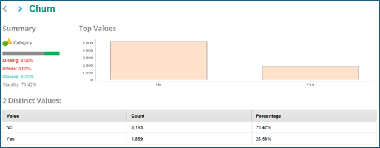
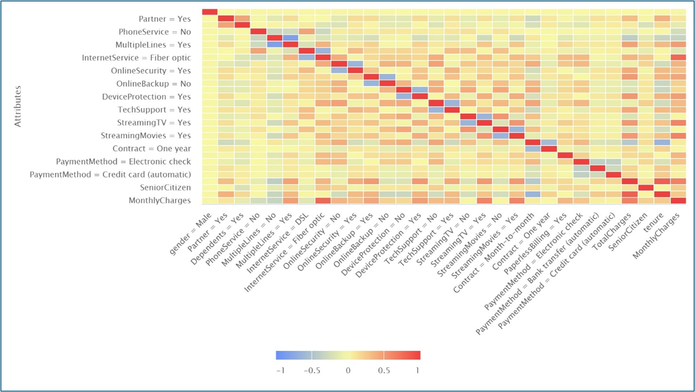
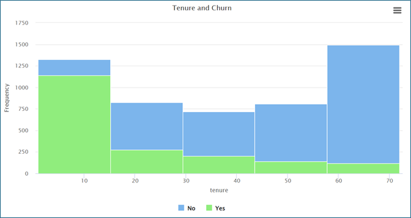
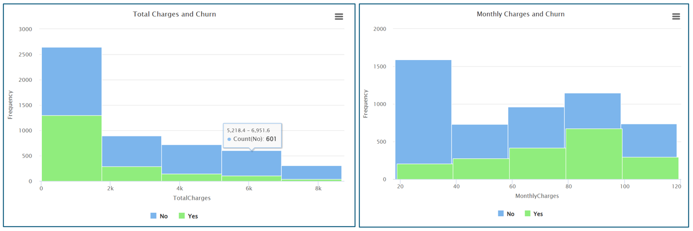
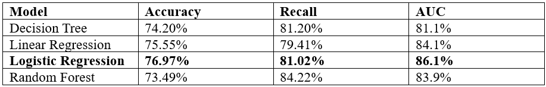

# Customer Churn Prediction in Telecommunications

Machine learning project predicting customer churn using supervised learning algorithms in RapidMiner. Achieved 86.1% AUC with Logistic Regression on IBM Telco dataset.

## Project Overview

**Objective:** Develop and evaluate multiple machine learning models to predict whether a telecommunications customer will churn, identify key drivers of customer attrition, and provide actionable insights for retention strategies.

**Business Context:** In the telecommunications industry, annual churn rates can exceed 30%, making customer retention a strategic priority. Acquiring new customers is 5-25× more expensive than retaining existing ones, making accurate churn prediction critical for profitability.

**Key Question:** Can we predict which customers are at risk of churning and identify the factors driving their decision to leave?

---

## Key Findings

### Model Performance Summary
- **Best Model:** Logistic Regression (86.1% AUC, 76.97% Accuracy)
- **Highest Recall:** Random Forest (84.22%, captures most churners)
- **Best Balance:** Logistic Regression (precision 54.50%, recall 81.02%, F1 65.16%)
- **Interpretability Winner:** Logistic Regression (clear coefficient interpretation)

### Top Churn Drivers Identified
1. **Month-to-month contracts:** Strongest positive predictor of churn
2. **Fiber optic service:** Significantly increases churn likelihood
3. **Tenure:** Longer customer relationships strongly reduce churn
4. **Total charges:** Higher lifetime value correlates with lower churn
5. **Electronic check payment:** Associated with higher churn rates

### Business Insights
- **26.58% overall churn rate** (1,869 of 7,032 customers)
- **New customers most at risk:** 1-15 month tenure shows highest churn
- **High monthly charges drive churn:** Customers paying $78-99/month churn more
- **Contract type matters:** Month-to-month customers churn at significantly higher rates than annual contract holders

---

## Dataset Information

**Source:** IBM Telco Customer Churn (via Kaggle/IBM Watson)  
**Records:** 7,043 customers (after removing 11 incomplete records)  
**Features:** 21 attributes across 4 categories  
**Target Variable:** Churn (Yes/No) - Binary classification  
**Class Distribution:** 73.42% No Churn, 26.58% Churn (imbalanced)

### Feature Categories

| Category | Attributes | Examples |
|----------|-----------|----------|
| **Demographic** | 4 | Gender, Senior Citizen, Partner, Dependents |
| **Service** | 9 | Phone Service, Internet Type, Online Security, Tech Support |
| **Account** | 3 | Tenure (months), Contract Type, Paperless Billing |
| **Billing** | 3 | Monthly Charges, Total Charges, Payment Method |

### Data Quality
- **No duplicates** found in dataset
- **11 missing records** removed (new customers with 0 tenure and no billing history)
- **CustomerID** excluded from modeling (non-informative identifier)

---

## Methodology

### 1. Data Preprocessing

**Cleaning Steps:**
- Removed 11 records with tenure = 0 and missing total charges (newly acquired customers)
- Verified no duplicate customer records
- Excluded CustomerID attribute (not predictive)

**Feature Engineering:**
- **Dummy coding:** Converted categorical variables to binary indicators
- **Comparison groups:** Set "No internet service" as baseline to avoid perfect collinearity
- **Normalization:** Scaled numerical features (tenure, charges) for regression models

**Class Balancing:**
- Applied **SMOTE (Synthetic Minority Oversampling Technique)** to training data
- Addressed 73%/27% class imbalance
- Generated synthetic minority class samples via interpolation (not duplication)
- Improved model's ability to detect churners without overfitting

---

### 2. Exploratory Data Analysis (EDA)

**Univariate Analysis:**
- Tenure: Range 1-72 months (average: 32 months)
- Monthly charges: Average $64.79
- Total charges: Average $2,283.30
- Demographics: 16.21% senior citizens, 51.7% without partners, 70% without dependents

**Bivariate Analysis:**
- **High correlations identified:**
  - Fiber optic service ↔ Monthly charges: 0.787
  - Total charges ↔ Tenure: 0.826
  - Service add-ons ↔ Monthly charges: ≥0.6
- **Churn patterns:**
  - New customers (1-15 months tenure): Highest churn
  - High monthly charges ($78-99): Elevated churn risk
  - Low total charges (<$2,000): Higher churn likelihood

---

### 3. Model Development

**Models Evaluated:**
1. **Decision Tree** (gain ratio criterion, max depth 15, pruning enabled)
2. **Linear Regression** (with SMOTE upsampling)
3. **Logistic Regression** (threshold 0.5, SMOTE upsampling)
4. **Random Forest** (ensemble method)

**Train-Test Split:** 80% training / 20% holdout validation

**Evaluation Metrics:**
- Accuracy, Classification Error
- AUC (Area Under ROC Curve)
- Precision, Recall, F1-Score
- Sensitivity, Specificity

---

## Results

### Model Performance Comparison

| Model | Accuracy | AUC | Precision | Recall | F1-Score | Specificity |
|-------|----------|-----|-----------|--------|----------|-------------|
| **Logistic Regression** | **76.97%** | **86.1%** | **54.50%** | **81.02%** | **65.16%** | **75.51%** |
| Linear Regression | 75.55% | 84.1% | 52.66% | 79.41% | 63.33% | 74.15% |
| Random Forest | 73.49% | 83.9% | 50.08% | 84.22% | 62.81% | 69.60% |
| Decision Tree | 74.20% | 80.1% | 50.92% | 81.02% | 62.54% | 71.73% |

### Why Logistic Regression Was Selected

**Strengths:**
- **Highest AUC (86.1%):** Best ability to distinguish churners from non-churners
- **Lowest classification error (23.03%):** Most accurate overall predictions
- **Best F1-score (65.16%):** Optimal balance between precision and recall
- **High interpretability:** Clear coefficient interpretation for business stakeholders
- **Balanced performance:** 81.02% recall (captures churners) + 54.50% precision (minimizes false alarms)

**Random Forest Trade-off:**
- Higher recall (84.22%) captures slightly more churners
- BUT: Lower precision (50.08%), specificity (69.60%), and accuracy (73.49%)
- Suggests potential overfitting and less reliable for business deployment

---

## Key Predictors of Churn

### Positive Churn Indicators (Increase Likelihood)
1. **Month-to-month contract** - Strongest predictor
2. **Fiber optic service** - High churn correlation
3. **Electronic check payment method**
4. **Higher monthly charges**

### Negative Churn Indicators (Decrease Likelihood)
1. **Longer tenure** - Customer loyalty over time
2. **Higher total charges** - Lifetime value investment
3. **Two-year contract** - Commitment reduces churn
4. **Automatic payment methods** - Convenience factor

---

## Business Recommendations

### 1. Target High-Risk Segments
- **New customers (0-15 months tenure):** Implement onboarding programs and 90-day check-ins
- **Month-to-month contract holders:** Offer incentives for annual/2-year contract upgrades
- **High monthly charge customers:** Review pricing vs. competitor offerings

### 2. Retention Strategies
- **Proactive outreach:** Use model predictions to identify at-risk customers before they churn
- **Contract incentives:** Discount annual contracts vs. month-to-month pricing
- **Payment friction reduction:** Migrate electronic check users to auto-pay
- **Service quality focus:** Investigate fiber optic service satisfaction issues

### 3. Predictive Action Triggers
- **Churn probability >70%:** Immediate retention specialist contact
- **Churn probability 50-70%:** Automated targeted offers (discounts, upgrades)
- **Churn probability 30-50%:** Satisfaction surveys and engagement campaigns

---

## Visualizations

### Churn Distribution

*26.58% of customers churned, indicating significant business impact*

### Correlation Heatmap

*Fiber optic service and monthly charges show high correlation (0.787)*

### Tenure vs. Churn

*New customers (1-15 months) exhibit highest churn rates*

### Charges vs. Churn

*High monthly charges ($78-99) and low total charges (<$2,000) correlate with elevated churn*

### Model Performance Comparison

*Logistic Regression achieves best AUC (86.1%) and F1-score (65.16%)*

---

**Note:** Visualizations are screenshots from RapidMiner analysis. Original RapidMiner process files (.rmp) not included due to proprietary data handling.

Full analysis available in: [`report/Customer_Churn_Analysis_Report.pdf`](report/Customer_Churn_Analysis_Report.pdf)

---

## Technologies Used

- **RapidMiner Studio:** Machine learning platform for model development and evaluation
- **SMOTE:** Synthetic Minority Oversampling Technique for class balancing
- **Statistical Analysis:** Correlation matrices, univariate/bivariate analysis
- **Machine Learning Algorithms:**
  - Logistic Regression (optimal model)
  - Decision Tree (gain ratio, pruning)
  - Random Forest (ensemble learning)
  - Linear Regression (baseline comparison)

---

## Skills Demonstrated

- **Machine Learning:** Supervised classification, model comparison, hyperparameter tuning
- **Data Preprocessing:** Missing value handling, feature engineering, dummy coding, normalization
- **Class Imbalance Handling:** SMOTE implementation to address 73/27 split
- **Exploratory Data Analysis:** Univariate/bivariate analysis, correlation analysis
- **Model Evaluation:** AUC-ROC, precision-recall trade-offs, F1-score optimization
- **Business Analytics:** Translating ML outputs into actionable retention strategies
- **Statistical Interpretation:** Coefficient analysis, statistical significance testing
- **Technical Communication:** Academic-quality documentation, stakeholder reporting

---

## Future Enhancements

- [ ] **Time-series analysis:** Predict churn timing (when, not just if)
- [ ] **Customer lifetime value (CLV) integration:** Prioritize high-value at-risk customers
- [ ] **Ensemble stacking:** Combine Logistic Regression + Random Forest predictions
- [ ] **Feature importance analysis:** SHAP values for model explainability
- [ ] **Real-time scoring:** Deploy model via API for CRM integration
- [ ] **A/B testing framework:** Measure retention campaign effectiveness
- [ ] **Segment-specific models:** Build specialized models for high-value vs. low-value customers
- [ ] **Survival analysis:** Cox proportional hazards model for time-to-churn

---

## Contact

**Sarina Gurung**  
Data Analyst | MS Business Analytics  
Webster University

- Email: sarinagurung012@gmail.com
- LinkedIn: [linkedin.com/in/sarina-gurung-a69b79324](https://www.linkedin.com/in/sarina-gurung-a69b79324/)

---

## License & Data Attribution

**Dataset:** IBM Telco Customer Churn (Kaggle/IBM Watson)  
**License:** Public Domain (IBM Sample Dataset)  
**Analysis & Report:** Original work by Sarina Gurung (October 2025)

This project is available for educational and portfolio purposes.

---

## References

Ahmad, A. K., Jafar, A., & Aljoumaa, K. (2019). Customer churn prediction in telecom using machine learning in big data platform. *Journal of Big Data, 6*(1). https://doi.org/10.1186/s40537-019-0191-6

Barsotti, A., et al. (2024). A Decade of Churn Prediction Techniques in the TelCo Domain: A Survey. *SN Computer Science, 5*(4). https://doi.org/10.1007/s42979-024-02722-7

Chang, V., et al. (2024). Prediction of Customer Churn Behavior in the Telecommunication Industry Using Machine Learning Models. *Algorithms, 17*(6), 231. https://doi.org/10.3390/a17060231

Poudel, S. S., Pokharel, S., & Timilsina, M. (2024). Explaining customer churn prediction in telecom industry using tabular machine learning models. *Machine Learning with Applications, 17*, 100567. https://doi.org/10.1016/j.mlwa.2024.100567

---

**If you found this project helpful, please star this repository!**
